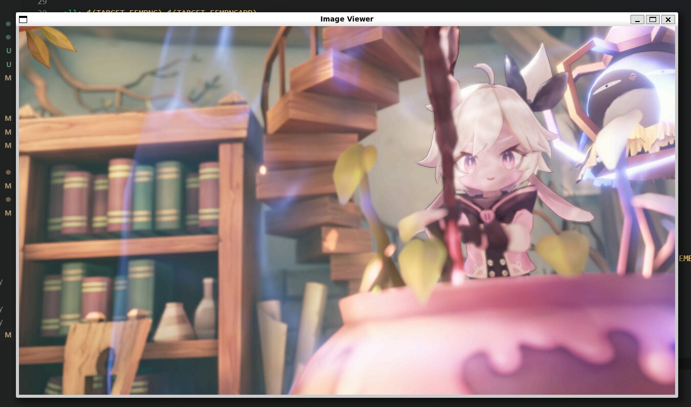

# Fembng



Fembng is a project that allows you to generate and view images

## Installation

Follow these steps to install and run the Fembng project:

### Prerequisites

- Make sure you have `gcc` 
and 
[`sdl2`](https://linux-packages.com/search-page?p=libsdl2&st=contain&d%5B%5D=1&d%5B%5D=13&d%5B%5D=22&d%5B%5D=3&d%5B%5D=29&d%5B%5D=20&d%5B%5D=14&d%5B%5D=9&d%5B%5D=24&d%5B%5D=30&d%5B%5D=28&d%5B%5D=19&d%5B%5D=5&d%5B%5D=15&d%5B%5D=18&d%5B%5D=12&d%5B%5D=6&d%5B%5D=11&d%5B%5D=7&d%5B%5D=2&d%5B%5D=10&d%5B%5D=27&d%5B%5D=8&d%5B%5D=25&d%5B%5D=26&d%5B%5D=33&d%5B%5D=21&d%5B%5D=32&d%5B%5D=17&d%5B%5D=4)
and 
[`libjpeg`](https://linux-packages.com/search-page?p=libjpeg&st=contain&d%5B%5D=1&d%5B%5D=13&d%5B%5D=22&d%5B%5D=3&d%5B%5D=29&d%5B%5D=20&d%5B%5D=14&d%5B%5D=9&d%5B%5D=24&d%5B%5D=30&d%5B%5D=28&d%5B%5D=19&d%5B%5D=5&d%5B%5D=15&d%5B%5D=18&d%5B%5D=12&d%5B%5D=6&d%5B%5D=11&d%5B%5D=7&d%5B%5D=2&d%5B%5D=10&d%5B%5D=27&d%5B%5D=8&d%5B%5D=25&d%5B%5D=26&d%5B%5D=33&d%5B%5D=21&d%5B%5D=32&d%5B%5D=17&d%5B%5D=4) installed.

### Clone the Repository

```bash
git clone https://github.com/MignonPetitXelow/Fembng.git ; cd Fembng
```

### Build the Project

```bash
make
```
### Run Fembng

To generate an image:
```bash
./bin/fembng -w <width> -h <height> -o <output_file>
```

Example:
```bash
./bin/fembng -w 800 -h 600 -o output
```

### 🎁 Generate femboy file from jpg

To generate an image:
```bash
./bin/fembng -c <input_file> -o <output_file>
```

Example:
```bash
./bin/fembng -c test.jpg -o outputjpg
```

### Run Fembng Viewer

To view a generated image:
```bash
./bin/fembngapp <image_file>
```

Example:
```bash
./bin/fembngapp output.femboy
```

### Contributing

Feel free to contribute to the project by opening issues or creating pull requests.
